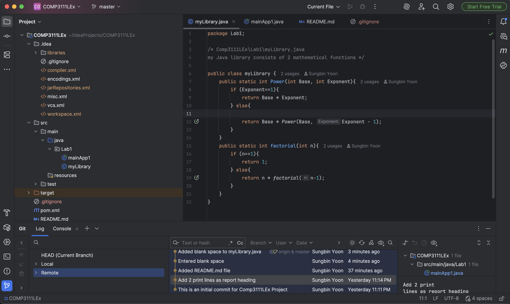

# COMP3111 Lab 1: Git and IntelliJ Setup

---

## Overview

This project is part of Lab 1 for COMP3111, focused on setting up the development environment with **IntelliJ IDEA** and **Git**. It demonstrates the process of creating a Maven project, connecting it to a GitHub repository, and managing commits.

---

## Key Learning Outcomes

* Successfully configured **IntelliJ IDEA** for Java development.
* Established a link between a local project and a **GitHub repository**.
* Practiced **committing and pushing** code changes to the remote repository.
* Created and formatted a `README.md` file using **Markdown**.

---

## Project Structure

* **`src/main/java/Lab1`**: Contains the primary Java source code for the lab assignment.
* **`pom.xml`**: The Maven project configuration file.
* **`README.md`**: This file provides an overview and documentation for the project.

---

### IntelliJ Project Screenshot

The following image shows the IntelliJ environment with the project structure, a Java class file, and the Git Log tool window with multiple commits.
